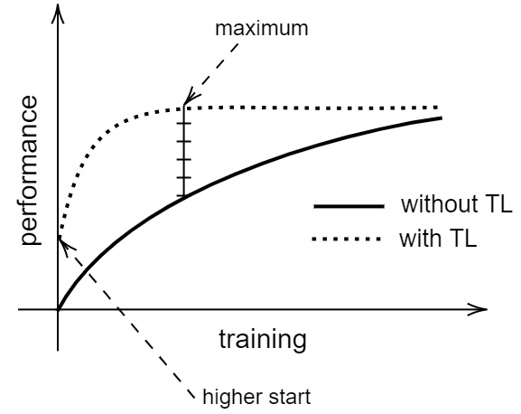

# Transfer Learning for Semantic Similarity Measures Based on Symbolic Regression

[](https://doi.org/10.3233/JIFS-230141)

## 🌟 Introduction
Recently, transfer learning strategies have become ideal for reusing acquired knowledge through a training phase. The key idea is that reusing such knowledge brings advantages such as increased accuracy and considerable resource savings. In this work, we design a novel strategy for effective and efficient transfer learning in semantic similarity. Our approach is based on generating and transferring optimal models obtained through a symbolic regression process, being able to stack evaluation scores from several fundamental techniques. After an exhaustive empirical study, the results lead to high accuracy in addition to significant savings in terms of training time consumed in most of the scenarios considered.



## 📚 Citation

Please cite our work if you find it useful:

```
@article{martinez2023,
  author       = {Jorge Martinez-Gil and
                  Jose Manuel Chaves-Gonzalez},
  title        = {Transfer learning for semantic similarity measures based on symbolic
                  regression},
  journal      = {J. Intell. Fuzzy Syst.},
  volume       = {45},
  number       = {1},
  pages        = {37--49},
  year         = {2023},
  url          = {https://doi.org/10.3233/JIFS-230141},
  doi          = {10.3233/JIFS-230141}
}
```

## 📄 License

This project is available under the MIT License.